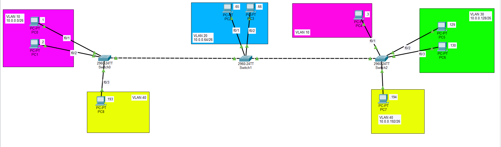

# Cisco VLAN & VTP Configuration Lab

This repository contains a Cisco Packet Tracer lab focused on configuring and verifying **VLAN Trunking Protocol (VTP)**, static **Trunking**, **Dynamic Trunking Protocol (DTP)** mitigation, and **Access Port** assignments across a multi-switch enterprise topology.

## Network Topology
The network consists of three 2960-24TT switches (**Switch0**, **Switch1**, and **Switch2**) connecting multiple end-host PCs segmented across different departments/VLANs:



### Topology Subnet & Port Mapping Table

| Switch | Connected Device | Switch Interface | Assigned VLAN | Subnet / IP Address |
| :--- | :--- | :--- | :--- | :--- |
| **Switch0** | PC0 | Fa0/1 | VLAN 10 | 10.0.0.0/26 (.1) |
| | PC1 | Fa0/2 | VLAN 10 | 10.0.0.0/26 (.2) |
| | PC8 | Fa0/3 | VLAN 40 | 10.0.0.192/26 (.193) |
| **Switch1** | PC2 | Fa0/1 | VLAN 20 | 10.0.0.64/26 (.65) |
| | PC3 | Fa0/2 | VLAN 20 | 10.0.0.64/26 (.66) |
| **Switch2** | PC4 | Fa0/1 | VLAN 10 | 10.0.0.0/26 (.3) |
| | PC5 | Fa0/2 | VLAN 30 | 10.0.0.128/26 (.129) |
| | PC6 | Fa0/3 | VLAN 30 | 10.0.0.128/26 (.130) |
| | PC7 | Fa0/4 | VLAN 40 | 10.0.0.192/26 (.194) |

---

## Lab Objectives & Core Tasks

### 1. Trunk Port and DTP Configuration
* Configure all inter-switch links between **Switch0**, **Switch1**, and **Switch2** as static trunk ports.
* Disable Dynamic Trunking Protocol (DTP) to secure the ports against negotiation attacks.
* **Verification:** Confirm the administrative and operational modes using `show interface switchport`.

### 2. VTP Server & Centralized VLANs (Switch0 / SW1)
* Configure **Switch0** in VTP domain `CCNA` with the operating mode set to **Server**.
* Create VLANs `10`, `20`, and `30` on **Switch0**.
* *Question:* Have Switch1 and Switch2 automatically added VLANs 10, 20, and 30 via VTP?

### 3. VTP Transparent Mode (Switch1 / SW2)
* Configure **Switch1** in VTP **Transparent** mode.
* Manually add `VLAN 40` to **Switch1**.
* *Question:* Is VLAN 40 added to the VLAN database of Switch0 or Switch2? 

### 4. VTP Client Mode (Switch2 / SW3)
* Configure **Switch2** in VTP **Client** mode.
* Attempt to manually configure `VLAN 50` on **Switch2**.
* *Question:* Is it successfully added? What message does the switch CLI return?

### 5. End-Host Access Ports
* Configure all edge switchports connected to PCs into their respective VLANs according to the port mapping table above.
* Hardcode them statically as access ports.
* *Question:* Is DTP still enabled on these access switchports?

---

## Cisco IOS Reference Commands

### Hardening Trunks (Disabling DTP)
```ios
interface [interface-id]
 switchport mode trunk
 switchport nonegotiate
```

### Setting VTP Modes
```ios
# On Switch0 (Server)
vtp domain CCNA
vtp mode server

# On Switch1 (Transparent)
vtp mode transparent

# On Switch2 (Client)
vtp domain CCNA
vtp mode client
```

### Static Access Ports (Example: Switch0 Setup)
```ios
interface FastEthernet0/1
 switchport mode access
 switchport access vlan 10
!
interface FastEthernet0/3
 switchport mode access
 switchport access vlan 40
```

### Key Verification Commands
* `show vtp status` - Check current VTP mode, domain name, and revision number.
* `show vlan brief` - Verify which VLANs exist locally in the switch's database.
* `show interface [interface-id] switchport` - Inspect operational trunking status and verify if `Negotiation of Trunking` is turned off.

